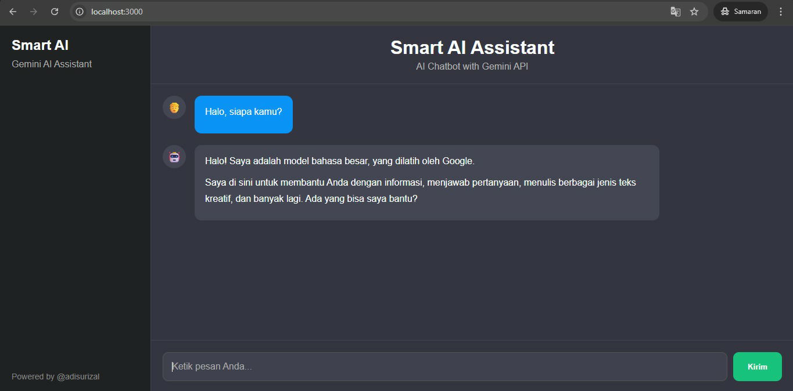

# Smart AI Assistant with Gemini API

Modern AI chatbot application built using React JS, Python Flask, and Google Gemini API.

## Preview

AI chatbot with:

* Modern ChatGPT-style interface
* Real-time AI conversation
* Gemini API integration
* React frontend
* Flask backend

---

## Features

* Real-time AI Chat
* Modern ChatGPT-like UI
* Gemini API Integration
* React JS Frontend
* Flask Backend API
* Responsive Design
* Markdown Rendering
* Typing Indicator
* Auto Scroll Chat

---

## Technologies Used

### Frontend

* React JS
* Axios
* React Markdown
* CSS3

### Backend

* Python
* Flask
* Flask-CORS
* Google GenAI SDK
* Python Dotenv

### AI Model

* Google Gemini API

---

## Project Structure

```bash
Smart-AI-Assistant-with-Gemini-API/
│
├── backend/
│   ├── app.py
│   └── requirements.txt
│
├── docs/
│   └── smart-ai-assistant.png
│
├── frontend/
│   ├── public/
│   ├── src/
│   └── package.json
│
├── .gitignore
└── README.md
```

---

## Installation

Clone repository:

```bash
git clone https://github.com/adisurizal/Smart-AI-Assistant-with-Gemini-API.git
```

---

# Backend Setup

Masuk ke folder backend:

```bash
cd backend
```

Buat virtual environment:

```bash
python3 -m venv venv
```

Aktifkan virtual environment:

Linux / WSL:

```bash
source venv/bin/activate
```

Windows CMD:

```bash
venv\\Scripts\\activate
```

Install dependency:

```bash
pip install -r requirements.txt
```

---

## Environment Variables

Buat file `.env` di folder `backend/`

Isi dengan:

```env
GEMINI_API_KEY=API_KEY_KAMU
```

Dapatkan API Key dari:

https://aistudio.google.com/app/apikey

---

## Menjalankan Backend

```bash
python3 app.py
```

Backend akan berjalan di:

```bash
http://127.0.0.1:5000
```

---

# Frontend Setup

Masuk ke folder frontend:

```bash
cd frontend
```

Install dependency:

```bash
npm install
```

Jalankan React app:

```bash
npm start
```

Frontend akan berjalan di:

```bash
http://localhost:3000
```

---

# API Endpoint

## POST `/chat`

Request:

```json
{
  "message": "Halo siapa kamu?"
}
```

Response:

```json
{
  "reply": "Halo! Saya adalah model bahasa AI..."
}
```

---

# Screenshot

Tambahkan screenshot aplikasi di sini.

Example:

```markdown

```

---

# Future Improvements

* Chat history
* Authentication
* Voice input
* File upload
* Retrieval-Augmented Generation (RAG)
* Dark/light mode toggle
* Database integration

---

# Author

### Created by @adisurizal

### Powered by @adisurizal 🚀

---

# License

This project is created for educational and portfolio purposes.
